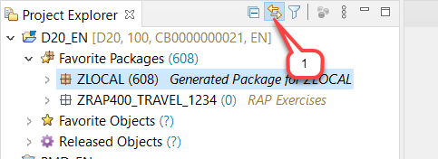

# Getting Started

## Introduction
You've already created an ABAP Trial Account and connected your ADT to it using a ABAP Cloud Project as described in the [Requirements](../../#requirements) section.

Please note that ADT dialogs and views as well as Fiori UIs may change in upcoming releases.

> **Hints and Tips**    
> Speed up typing by making use of the Code Completion feature (shortcut **Ctrl+Space**) and the prepared code snippets provided. 
> You can easily open an object with the shortcut **Ctrl+Shift+A**, format your source code using the Pretty Printer feature **Shift+F1** and toggle the fullscreen of the editor using the shortcut **Ctrl+M**.
>
> An overview of ADT shortcuts can be found here: [Useful ADT Shortcuts](https://blogs.sap.com/2013/11/21/useful-keyboard-shortcuts-for-abap-in-eclipse/)

## Group ID

As the ABAP Trial environment is used by many people, we've defined a naming pattern for each artefact you are going to create to make sure it doesn't conflict with other ones. For this, you'll find the placeholder **`####`** used in object names that must be replaced with the group ID assigned to you during the exercises. 

The 4-digit **group ID** will be generated for you in the next exercise. 

> **Hints and Tips**    
> The screenshots in this document have been taken using group ID **`1234`** and system **`D20`**.

## Find/Replace

During these exercises you will frequently see the task to "_replace the placeholder **`####`** with your group ID_". For this it's recommended to make use of the **Find/Replace** feature of the Eclipse Editor. It can be opened either via the menu (**_Edit -> Find/Replace..._**) or via **Ctrl+F**.
  
   
   
   Choosing **Replace All** allows you to replace all ocurrences of **`####`** with your group ID.

## Link with Editor (Optional) 

Enable the **Link with Editor** option by clicking on the doppel arrows in the toolbar of the _Project Explorer_ view as shown on the screenshot - if not yet linked.  
Whenever this option is enabled, the current object in the editor will be automatically selected and highlighted in the expanded _Project Explorer_ tree.

   
   

## Summary

You're ready to go! 

## Next Exercise

You can continue with the next exercise:
   - [Exercise 1 - Build Your transactional UI Service](../ex1/README.md) to build the transactional UI service for which you will write ABAP unit tests.
   
