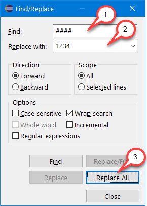
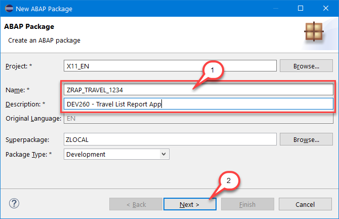
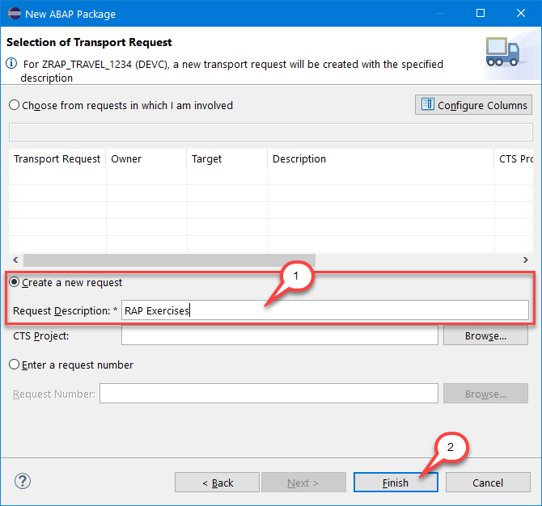
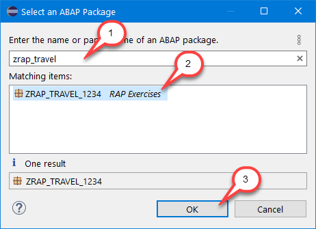
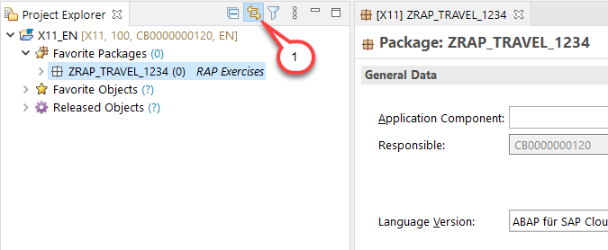

# Getting Started - Regular Track

## Introduction
You've already created an ABAP Trial Account and connected your ADT to it using a ABAP Cloud Project as described in the [Requirements](../../../../#requirements) section.

In this exercise you will define a group ID that you will need in the course of this workshop to uniquely identify your repository artefacts and separate them from those of other users conducting the same workshop on this system.

Furthermore you will create a development package that will contain all your artefacts.

Please note that ADT dialogs and views as well as Fiori UIs may change in upcoming releases.

> **Hints and Tips**    
> Speed up typing by making use of the Code Completion feature (shortcut Ctrl+Space) and the prepared code snippets provided. 
> You can easily open an object with the shortcut *Ctrl+Shift+A*, format your source code using the Pretty Printer feature *Shift+F1* and toggle the fullscreen of the editor using the shortcut *Ctrl+M*.
>
> An overview of ADT shortcuts can be found here: [Useful ADT Shortcuts](https://blogs.sap.com/2013/11/21/useful-keyboard-shortcuts-for-abap-in-eclipse/)

## Group ID

As the ABAP Trial environment is used by many people, we've defined a naming pattern for each artefact you are going to create to make sure it doesn't conflict with other ones. For this you'll find the placeholder **`####`** used in object names that must be replaced with the group ID of your choice during the exercises. The group ID can contain a maximum of 4 characters (numbers and letters). 

You can check for **already used group IDs** by choosing Open ABAP Development Object  (Ctrl+Shift+A) and searching for e.g. `zrap_travel_`. This lists all artefacts fitting that pattern. Try to add e.g. your initials, followed by a number to verify nobody else is already using this group ID.

   

*No results* means this group ID seems to be available. 

Once you've found an available group ID, choose **Cancel**.

> **Hints and Tips**    
> The screenshots in this document have been taken using group ID `1234` and system `X11`. We **don't recommend** using group ID `1234`.

## Find/Replace

In the course of these exercises you will frequently see the task to "_replace the placeholder `####` with your group ID_". For this it's recommended to make use of the **Find/Replace** feature of the Eclipse Editor. It can be opened either via the menu (**_Edit -> Find/Replace..._**) or via **Ctrl+F**.
  
   
   
   Choosing **Replace All** allows you to replace all ocurrences of `####` with your group ID.

## Create an ABAP package for your repository objects

1. In the Project Explorer, expand your ABAP Cloud project, right-click on **Project** and choose **_New > ABAP Package_** from the context menu.  
  
   

2. Maintain `ZRAP_TRAVEL_####` (where `####` is your chosen group ID) as **Name** and a meaningful **Description** (e.g. _`DEV260 - RAP Exercises`_). Make sure the Superpackage is set to `ZLOCAL`. Choose **Next** to continue.  
  
   

3. Assign a transport request. For that, either select an existing transport request – if available – or choose **Create a new request**, enter a meaningful **Request Description** and choose **Finish**.  

     
  
   The editor shows the created package.
  
   

4. **Optional**: Add your ABAP package to the **Favorites Packages**  
To add an ABAP package to your _Favorite Packages_, either (a) right-click on the relevant package and choose the context menu entry **Add to Favorite Packages** or (b) right-click on the **Favorites Packages** folder in the Project Explorer, choose the context menu entry **Add Package...**, filter the entries for the relevant package, mark your package and press **OK** to add it. 

     
  
   

5. **Optional**: Enable the **Link with Editor** option. Whenever this option is enabled, the current object in the editor will be automatically selected in the expanded Project Explorer tree.

   

## Summary

Now that you have...
- specified your individual group ID and 
- created a package, 

you can continue withthe following exercise:
   
   - \[Regular Track\]: [Exercise 1 - Database Tables](../ex1/README.md) to create the data model step-by-step
