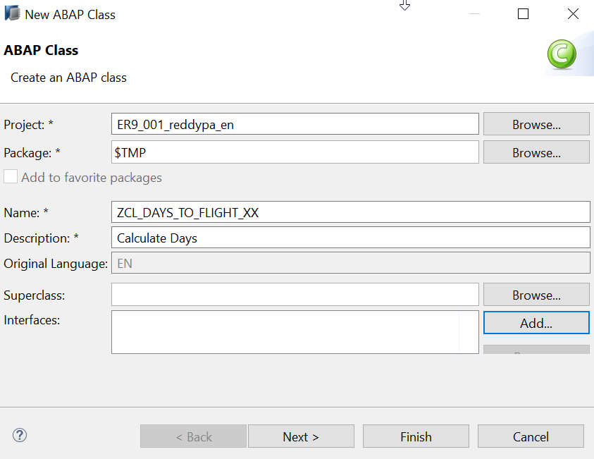
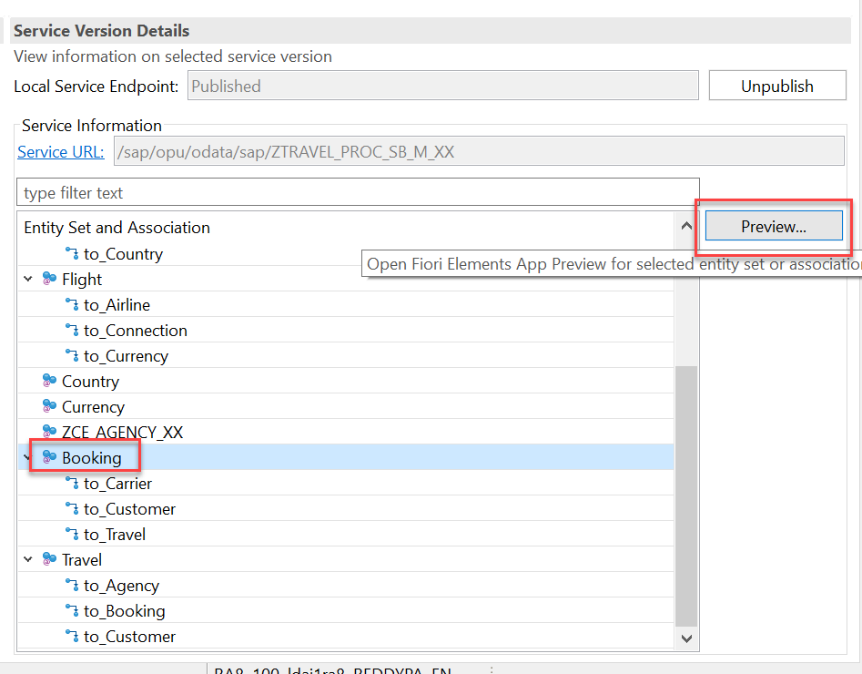
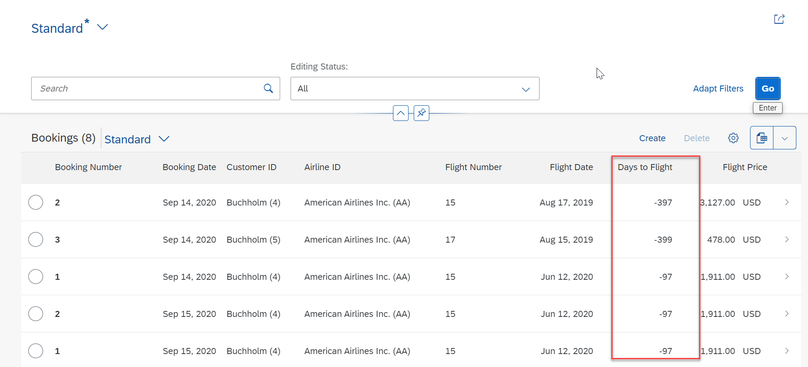
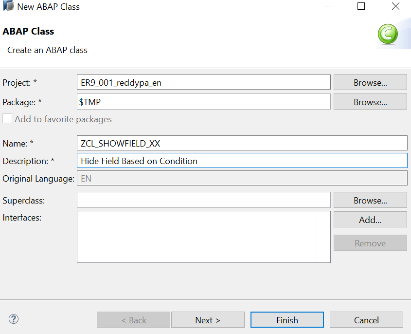
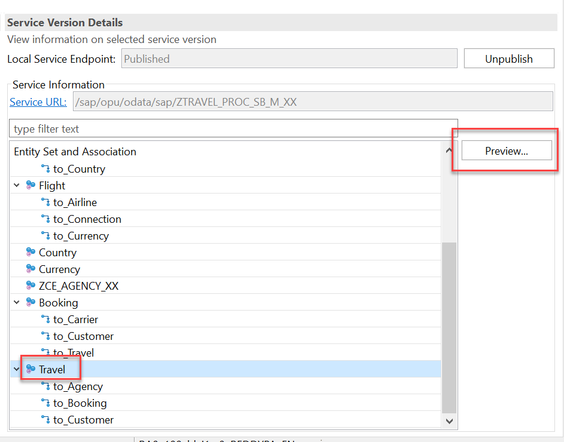
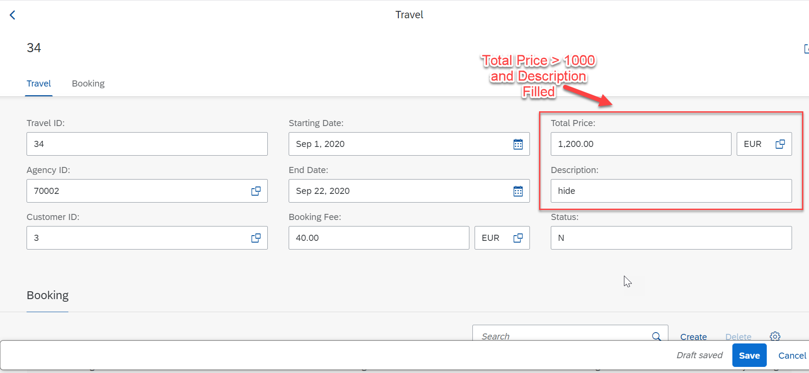

**Previous Step**

[Integrating Augment and Precheck in managed Business Objects](/docs/Managed%20Implementation/Augment%20and%20Precheck/README.md)

# Using of Virtual Elements in CDS Projection Views and Hiding of field in Object Page

* [Exercise 1 - Using Virtual Elements in CDS Projection Views](#exercise-1)
* [Exercise 2 - Hiding Fields Dynamically on the Object Page](#exercise-2)

<a id="exercise-1"></a>
# Exercise 1 - Using Virtual Elements in CDS Projection Views

With virtual elements, you define additional CDS elements that are not persisted on the database, but calculated during runtime using ABAP classes that implement the virtual element interface.

For some business use cases, it may be necessary to add new elements to the data model of an application whose values cannot be fetched from the database. Virtual elements are used if these elements are not provided as part of the original persistence data model but can be calculated using ABAP resources during runtime.

Virtual elements represent transient fields in business applications. They are defined at the level of CDS projection views as additional elements within the `SELECT` list. However, the calculation of their values is carried out by means of ABAP classes that implement the specific virtual element interface provided for this purpose. The ABAP implementation class is referenced by annotating the virtual element in the CDS projection view with `@ObjectModel.virtualElementCalculatedBy: 'ABAP:<CLASS_NAME>'`. With data retrieval via OData, the query framework calls the ABAP implementation class of the virtual element to retrieve the value for it..

The OData service metadata do not differentiate between regular CDS elements with database persistence and virtual elements. Consequently, the virtual element appears in an application UI equal to any other element.


 
Note:

• 	You can use virtual elements only in CDS projection views.

•	In the current version of the ABAP RESTful Programming Model, you cannot add implementations for filtering or sorting by virtual elements.

•	Virtual elements cannot be keys of the CDS projection view.

•	Virtual elements cannot be used together with the grouping or the aggregation function.

•	Data from virtual elements can only be retrieved via the query framework. In particular this means that the following options to retrieve data from CDS are **not** possible for virtual elements:

o	ABAP SQL `SELECT` on CDS views return initial values for the virtual element,

o	EML `READ` on BO entities is not possible as EML does not know virtual elements.

You can also have different virtual elements in different BO projections. With those, you are flexible in providing an accurately tailored projection layer for one specific service without affecting the basic business object.

You can use virtual element for read-only, as well as for transactional scenarios.

In an application that processes flight bookings, we want to include a field that calculates how many days are left until the flight date, or how many days have passed since the flight date. 

The following booking app UI provides the booking information with an additional field `Days` to `Flight` that calculates the days that have passed since the flight or the days that are left until the flight. The value is calculated by comparing the flight date with the system date.

Syntax for Defining a Virtual Element in CDS Projection View


```define view entity CDSProjView as projection on CDSEntity
{

 	key      elem_1          as Element1,
        [@EndUserText.label: 'Element Label']
        [@EndUserText.quickInfo: 'Quick Information']
        @ObjectModel.virtualElementCalculatedBy: 'ABAP:ABAPClass
	   
  	virtual  ElemName : {DataElement | ABAPType } ,
...
}
```
1.	Open the Booking CDS Projection view for which you want to define the virtual element. In our case: **ZC_BOOKING_PROCESSOR_M_XX** (Replace XX with your initials). Use `Ctrl + Shift + A` shortcut key and give **ZC_BOOKING_PROCESSOR_M_XX** Replace XX with your initials) in search criteria and click on OK to open the CDS View. 

2.	To define a virtual element, use the keyword virtual and specify a name for the virtual element. Place below code at the end.

```
LastChangedAt,

….

 virtual DaysToFlight : abap.int2,
 
….
```

 Aliases for virtual elements are not allowed, as you can choose the name of the element freely. Since a virtual element does not have database persistence and therefore does not have a defined data type, you have to specify the type of the element. Predefined data elements can be used as well as ABAP types.

3.	Annotate the virtual element with the annotation `@ObjectModel.virtualElementCalculatedBy` and reference the ABAP class that calculates the values for the virtual element.

      ```
      @ObjectModel.virtualElementCalculatedBy: 'ABAP:ZCL_DAYS_TO_FLIGHT_XX'
      
       @EndUserText.label: 'Days to Flight'
      
       @EndUserText.quickInfo: 'Calculates the Relative Flight Date'
      
       virtual DaysToFlight : abap.int2
       
       ```
      

As the `@ObjectModel` annotation references an ABAP resource from CDS, you must use the exact syntax `'ABAP:<class_name>'` as the value for the annotation. No space between colon and `<class_name>` is allowed.

If you use a basic ABAP type for your virtual element, define end-user information for the element with the `@EndUser.Text annotation.`

The label you choose for the end-user text is used in the metadata of an OData service that uses the CDS views. It is also used as a fallback if no label is maintained in @UI annotations to display the element on a UI.

If the virtual element uses a predefined data element, the OData metadata deduces the information from the data element.

4.	Create class **ZCL_DAYS_TO_FLIGHT_XX**


 
5.	Add the interface **IF_SADL_EXIT_CALC_ELEMENT_READ** to the public section of your calculation class and add the two method implementations.

```
CLASS zcl_days_to_flight_xx DEFINITION
  PUBLIC
  FINAL
  CREATE PUBLIC .

  PUBLIC SECTION.
  INTERFACES if_sadl_exit_calc_element_read.
  PROTECTED SECTION.
  PRIVATE SECTION.
ENDCLASS.


CLASS zcl_days_to_flight_xx IMPLEMENTATION.

  METHOD if_sadl_exit_calc_element_read~get_calculation_info.
  ENDMETHOD.

  METHOD if_sadl_exit_calc_element_read~calculate.
  ENDMETHOD.

ENDCLASS.
```


6.	Implement the method **get_calculation_info**

```
METHOD if_sadl_exit_calc_element_read~get_calculation_info.
  IF iv_entity <> 'ZC_BOOKING_PROCESSOR_M_XX'.
*      RAISE EXCEPTION TYPE /dmo/cx_virtual_elements
*        EXPORTING
*          textid = /dmo/cx_virtual_elements=>entity_not_known
*          entity = iv_entity.
    ENDIF.

    LOOP AT it_requested_calc_elements ASSIGNING FIELD-SYMBOL(<fs_calc_element>).
      CASE <fs_calc_element>.
        WHEN 'DAYSTOFLIGHT'.
          APPEND 'FLIGHTDATE' TO et_requested_orig_elements.

*        WHEN 'ANOTHERELEMENT'.
*          APPEND '' ...

        WHEN OTHERS.
*          RAISE EXCEPTION TYPE /dmo/cx_virtual_elements
*            EXPORTING
*              textid  = /dmo/cx_virtual_elements=>virtual_element_not_known
*              element = <fs_calc_element>
*              entity  = iv_entity.
      ENDCASE.
    ENDLOOP.
  ENDMETHOD.
  ```

  
At first, we check if the requested entity is the entity that contains the virtual element for which the calculation is intended. To calculate the remaining time or the passed time compared to the flight date, we need the element FlightDate. This element is added to the requested elements list to ensure that the value is available to calculate the virtual element.

It is possible to calculate the values for more than one virtual element in the same ABAP class. Depending on the virtual element, you might have to append different elements to the list of requested elements.

The methods of the interface **IF_SADL_CAL_ELEMENT_READ** import and export their parameters as strings in upper case. The CDS entity and element names must therefore be in upper case as well, so they can be mapped correctly.

7.	Implement the **method calculate**.


```
DATA(lv_today) = cl_abap_context_info=>get_system_date( ).
    
    DATA lt_original_data TYPE STANDARD TABLE OF ZC_BOOKING_PROCESSOR_M_XX WITH DEFAULT KEY.
    
    lt_original_data = CORRESPONDING #( it_original_data ).

    LOOP AT lt_original_data ASSIGNING FIELD-SYMBOL(<fs_original_data>).
    
      IF  <fs_original_data>-FlightDate IS NOT INITIAL.
      
        <fs_original_data>-DaysToFlight =  <fs_original_data>-FlightDate - lv_today.
	
      ENDIF.
      
    ENDLOOP.

    ct_calculated_data = CORRESPONDING #(  lt_original_data ).
    
```

    
In our example, we want to calculate how many days are left before the flight or how many days have passed since the flight, so we compare the value of FLIGHTDATE with today's date to calculate the value for the virtual element.

The system date can be retrieved via **cl_abap_context_info=>get_system_date( ).**

ABAP is able to calculate with date types as long as the date context is clear. The actual calculation is therefore quite easy: We just subtract the today's date from the flight date. The returning parameter can then be filled with the calculated days to flight.

8.	Add element and annotation to view **ZC_BOOKING_PROCESSOR_M_XX**  to display the DaysToFlight in the UI:

  ```
  @UI: { lineItem:       [ { position: 80, importance: #HIGH } ] }
  DaysToFlight;
  
  ```
  
9.	Preview the Booking UI to see the field `DaysToFlight`






#### Solution 
Solution for this exercise can be found [here](/docs/Managed%20Implementation/VirtualElement/Solutions/Exercise1)


<a id="exercise-2"></a>
# Exercise 2 - Hiding Fields Dynamically on the Object Page

You can use the `hidden` annotation in combination with a virtual element to show or hide fields dynamically on the UI depending on a boolean value. If the return value corresponds to `true`, the respective field is hidden and if the value corresponds to `false` the respective field is shown on the user interface. 

**Context:**
In the following definition, the extracted field is checked for its numeric value, if the value of **TotalPrice** is greater than 1000 then the method returns `abap_true` and the Description is hidden on the object page. If the contained value is less then 1000, the methord returns `abap_false` and the `Description` is displayed on the user interface. You can check any value against any condition and determine the visibility of the respective field dynamically.

You require the following steps to enable dynamic field hiding with a virtual element:

1.	Define a virtual element in the Travel projection CDS view - **ZC_TRAVEL_PROCESSOR_M_XX**

      ```
      LastChangedAt,
      
      @ObjectModel.virtualElementCalculatedBy: 'ABAP:ZCL_SHOWFIELD_XX'
      
            virtual testField :abap_boolean,
	    
	    ```
            
2.	Save and activate

3.	Create an ABAP class to determine the return value for the virtual element.


 
4.	Copy below code and replace **‘XX’** with your initials.

```

CLASS zcl_showfield_xx DEFINITION
  PUBLIC
  FINAL
  CREATE PUBLIC .

  PUBLIC SECTION.
  
    INTERFACES if_sadl_exit_calc_element_read.
    
  PROTECTED SECTION.
  
  PRIVATE SECTION.
  
ENDCLASS.


CLASS zcl_showfield_xx IMPLEMENTATION.
  METHOD if_sadl_exit_calc_element_read~calculate.

* Check the field for your condition and return either abap_true or abap_false for the

* virtual field.

    DATA lt_original_data TYPE STANDARD TABLE OF ZC_TRAVEL_PROCESSOR_M_XX WITH DEFAULT KEY.
    lt_original_data = CORRESPONDING #( it_original_data ).


    LOOP AT lt_original_data ASSIGNING FIELD-SYMBOL(<fs_original_data>).
    
      <fs_original_data>-testField =    COND abap_boolean( WHEN <fs_original_data>-TotalPrice > 1000 THEN abap_true ELSE abap_false ).
      
    ENDLOOP.

    ct_calculated_data = CORRESPONDING #( lt_original_data ).


  ENDMETHOD.


 METHOD if_sadl_exit_calc_element_read~get_calculation_info.

* Extract the field you want the field visibility to depend on


    IF iv_entity <> ' ZC_TRAVEL_PROCESSOR_M_XX'.
*      RAISE EXCEPTION TYPE /dmo/cx_virtual_elements
*        EXPORTING
*          textid = /dmo/cx_virtual_elements=>entity_not_known
*          entity = iv_entity.

    ENDIF.

    LOOP AT it_requested_calc_elements ASSIGNING FIELD-SYMBOL(<fs_calc_element>).
    
      CASE <fs_calc_element>.
      
        WHEN 'testField'.
	
          APPEND 'TotalPrice' TO et_requested_orig_elements.
	  
          ...
	  
      ENDCASE.
      
    ENDLOOP.
    
  ENDMETHOD.
  
ENDCLASS.

```

5.	Save and Activate the Class.

6.	Open view **ZC_TRAVEL_PROCESSOR_M_XX** and annotate the field you want to dynamically hide the respective field on the object page using hidden: #(testField)

```
…
  @UI: { lineItem:       [ { position: 90, importance: #MEDIUM } ] ,
  
         identification: [ { position: 90, hidden: #(testField) } ] }  
	 
  Description;
….

```

7.	Save and Activate the metadata extension.

8.	Preview to test the functionality:


 
Click on Create to create a travel:
 


Click on enter or on save description is hidden. 


#### Solution 
Solution for this exercise can be found [here](/docs/Managed%20Implementation/VirtualElement/Solutions/Exercise2)

**Next Steps**

[Integrating Additional Save and UnManaged Save in Managed Business Objects](/docs/Managed%20Implementation/AdditionalandUnManagedSave/readme.md)

