# Defining the Custom CDS Entity
* [Introduction](#introduction)
* [Exercise 1 - Creating the Service Consumption Model](#exercise-1---creating-the-service-consumption-model)
* [Exercise 2 - Defining the Custom CDS Entity](#exercise-2---defining-the-custom-cds-entity)
* [Exercise 3 - Create a class that implements the query for the custom entity](#exercise-3---create-a-class-that-implements-the-query-for-the-custom-entity)  

<a id="#introduction"></a>  
# Introduction  
  In this exercise, we want to replace the travel agencies data of our managed travel app with the results of the remote OData service that provides different set of travel agencies from other system altogether. For this use case, we shall leverage the concept of a custom entity.
  In contrast to "normal" CDS views that read data from the database tables or other CDS views, the so called custom entities act as a wrapper for a code based implementation that provides the data instead. This use case involves following steps.  

<a id="#exercise-1"></a>  
# Exercise 1 - Creating the Service Consumption Model  

  Step 1: Download $metadata file  
  The $metadata file of the OData service that we want to consume must be uploaded in XML file format. Hence you have to download it first.
  Click on the following URL and download the $metadata file in your computer, it will be required later in this exercise.  
  https://sapes5.sapdevcenter.com/sap/opu/odata/sap/ZAGENCYCDS_SRV/$metadata  
  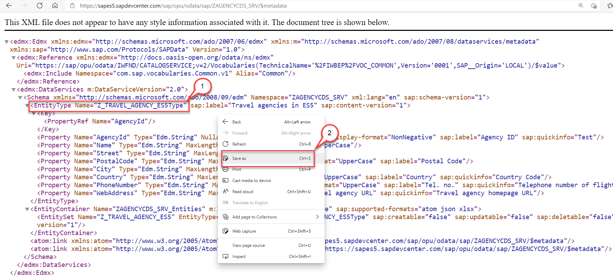  

  Step 2: Create the Service Consumption Model  
  We start by creating a service consumption model for an OData service that provides a list of travel agencies. This service resides on the public SAP Gateway System ES5 and does not require any authentication.  

1. Switch to ADT and right click on your local package. Select New > Other ABAP Repository Object.  
  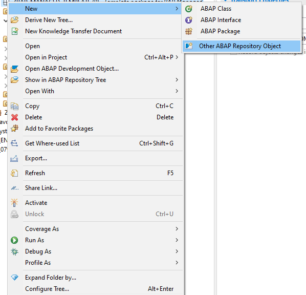
  
2.	In the New ABAP Repository Object dialogue do the following  
  Start to type Service in the list of objects  
  Select Service Consumption Model  
  Click Next  


3.	The New Service Consumption Model dialogue opens. Here enter the following data:  
  Name: ZSC_RAP_AGENCY_XX  
  Description: Agencies from ES5  
  Package: $tmp  
  Remote Consumption Model: OData (to be selected from the dropdown box)  
Caution:  Be sure that you have selected OData as the Remote Consumption Mode from the dropdown box. There are other options such as Web Service and RFC (planned) available as well.  
  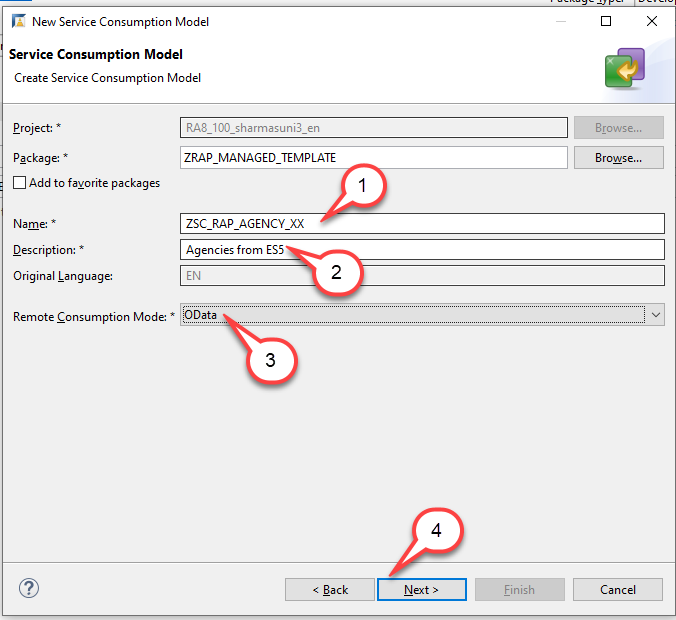
  
4. The $metadata file of the OData service that we want to consume must be uploaded in file format.  
  Click Browse to select the $metadata file that you have downloaded earlier in this exercise  
  Prefix: Enter RAP_XX  
  Click Next  
Please note if you enter a prefix, this prefix will be added to the names of the abstract entities that are generated. If you don't select a prefix and if the wizard finds out that there would be name clashes the wizard will propose unique names by adding arbitrary characters to the repository object names. In any case you will be able to change the values that will be proposed by this wizard.  
  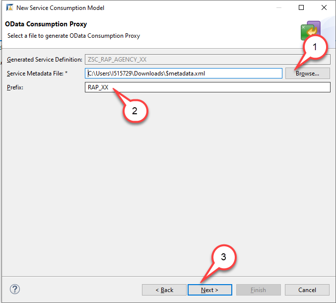

5. Check the ABAP Artifact Name.
  You will notice that the name of the ABAP artifact has been set to ZRAP_XXZ_TRAVEL_AGENCY_ES5 since we have provided the prefix RAP_XX and the name of the entity itself is Z_TRAVEL_AGENCY_ES5.  
  Press Next.  
  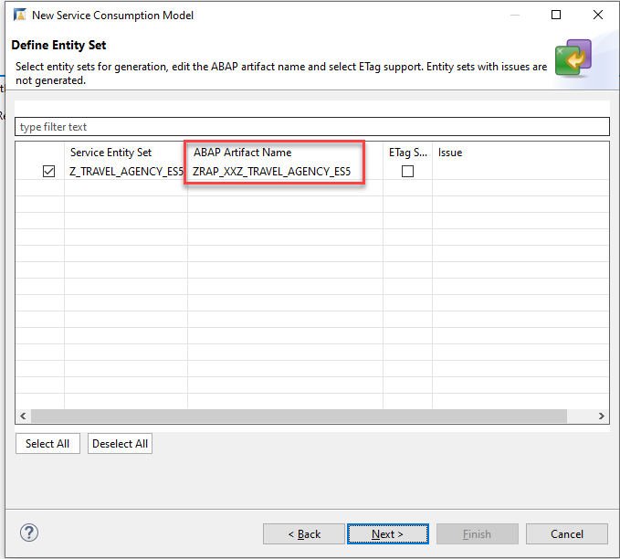

6.	The wizard will now list the repository objects that will be generated, namely a service definition and an abstract entity in addition to the service consumption model.  
  Service Definition: ZSC_RAP_AGENCY_XX  
  Abstract Entity: ZRAP_XXZ_TRAVEL_AGENCY_ES5  
  Click Next.  
  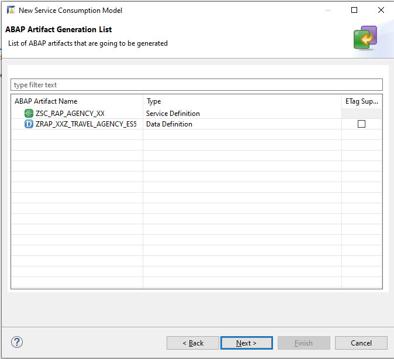
  
7.	Press Finish.  
  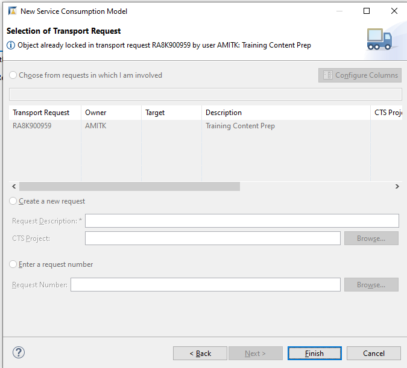

8.	Let us shortly investigate the service consumption model.  
  For each operation (Read List, Read, Create, Update and Delete) some sample code has been created that you can use when you want to call the OData Service with one of these operations. Since we want to retrieve a list of Agencies, we will select the operation Read List and use this code.  
  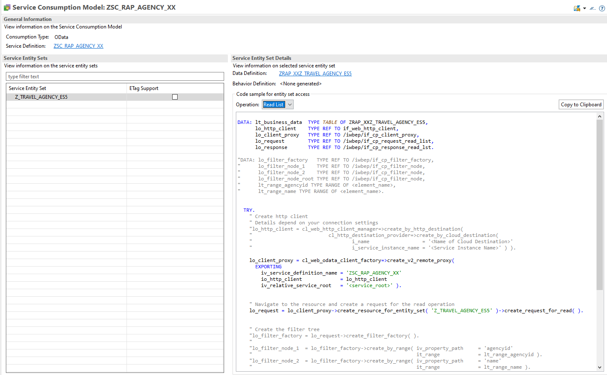  

<a id="#exercise-2"></a>  
## Exercise 2 - Defining the Custom CDS Entity  
The custom entity must be created manually with similar syntax as the abstract entity that has been created when we have created our service consumption model.
To leverage the remote OData service in our application we have thus to perform two steps:
o	We must create a custom entity.
o	We must create a class that implements the query for the custom entity.
Create a custom entity
1.	Right-click on the folder Data Definition and select New Data Definition.
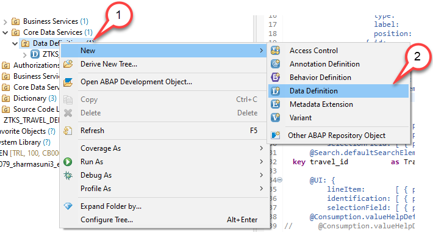

2.	Let’s start with creating a new data definition ZCE_RAP_AGENCY_XX using the template for a Custom Entity.
The New Data Definition dialogue opens  
 Name: ZCE_RAP_AGENCY_XX  
 Description: Custom entity for agencies from ES5  
 Package: $tmp  
Press Next  


 
3.	Press Next. Do NOT press Finish.
Caution
If you would press Finish instead of Next the wizard will use the template that was used the last time when this wizard was used by the developer.

To be sure which template will be selected, we MUST press Next and not Finish which would skip the step of template selection.
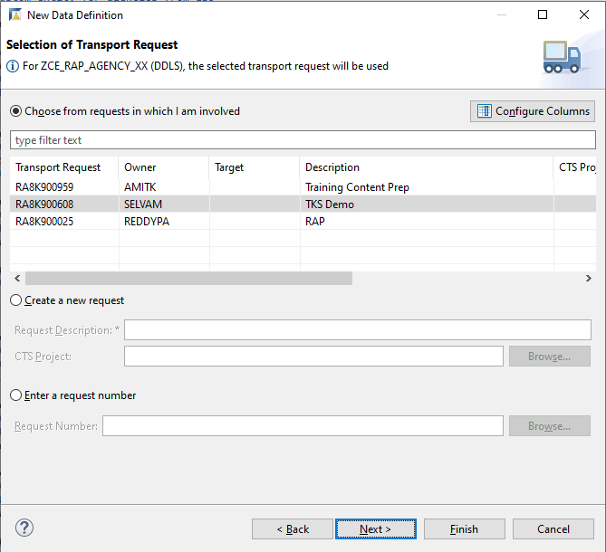
 
4.	Select Template  
  Use the scroll bar to navigate down the list  
  Select the template Define Custom Entity with Parameters  
  Press Finish  
Please note  
There is only one template available for a custom entity i.e. Custom entity with parameters. But this doesn’t matter. We use this template and remove the statement with parameters "parameter_name : parameter_type".  
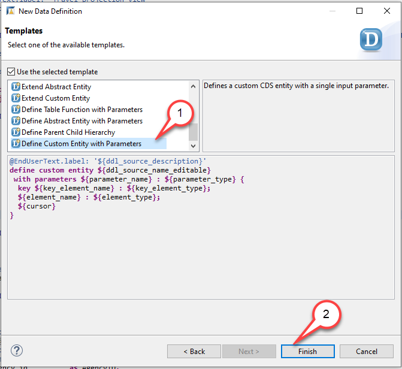

5.	Edit the source code of the custom entity ZCE_RAP_AGENCY_XX
  Remove the statement with parameters parameter_name : parameter_type  


6.	Now, open the abstract entity you created in Exercise 1 in the source code editor  
  Navigate to the abstract entity ZRAP_XXZ_TRAVEL_AGENCY_ES5 in the Project Explorer  
  Double click on it to open the source code editor  
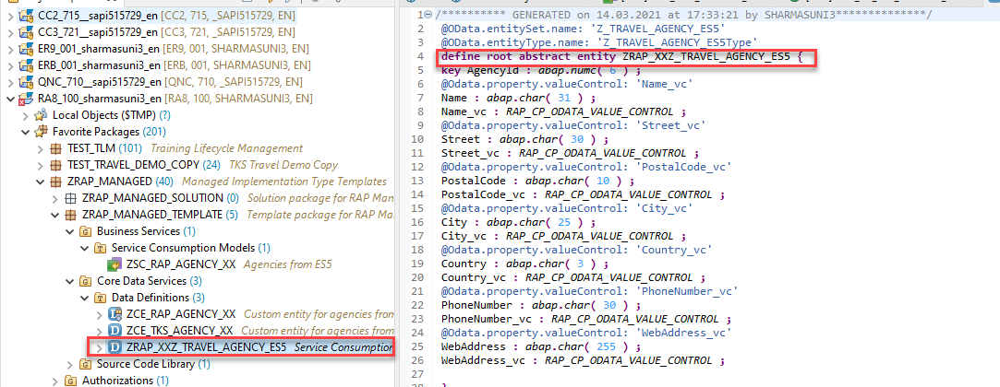

7.	Copy field list from abstract entity to custom entity  
  Copy the field list from the abstract entity and paste it between the curly brackets as the new field list of the custom entity, thereby replacing the field list provided by the code template. You can make use of the Source Code Formatter (SHIFT+F1) to format the source code.  
  
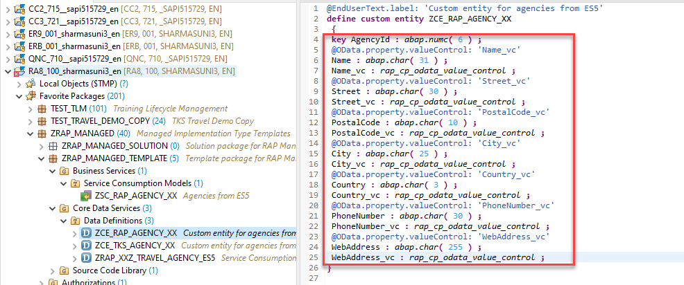  
 
8.	Add the annotation @ObjectModel.Query.ImplementedBy to the DDL source code  
@ObjectModel.query.implementedBy: 'ABAP:ZCL_CE_RAP_AGENCY_XX' and activate your changes.  
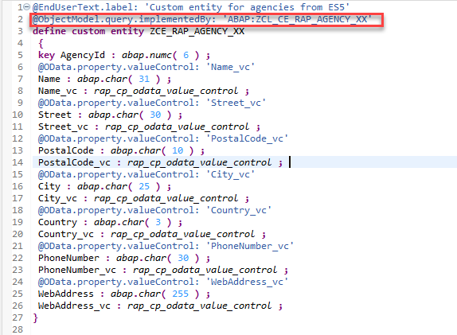 

Summary  
In this unit you have created a custom entity based on the abstract entity that has been generated when activating the service consumption model.

<a id="#exercise-3"></a>  
## Exercise 3 - Create a class that implements the query for the custom entity  
To be able to use our class as a query implementation class of our custom entity our class must implement the interface if_rap_query_provider. We will thus add this interface to it.  
Hints and Tips  
Speed up the typing by making use of the Code Completion feature (shortcut Ctrl+Space) and the prepared code snippets provided. You can easily open an object with the shortcut Ctrl+Shift+A, format your source code using the Pretty Printer feature Shift+F1 and toggle the fullscreen of the editor using the shortcut Ctrl+M.  
Please note that the placeholder XX used in object names in the exercise description must be replaced with the suffix of your choice during the exercises. The suffix can contain a maximum of 2 characters (numbers and letters). The screenshots in this document have been taken with the suffix XX and system RA8.  

Follow the instructions below.  
Creating the implementation  
1.	Right-click on your package and go to New-> Other ABAP Repository Objects.  
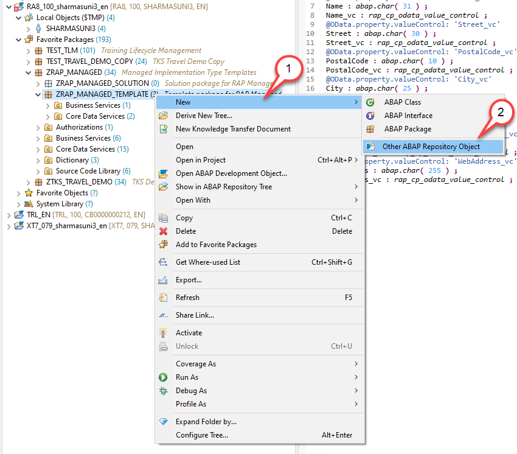 

2.	Search for ABAP class and press Next  
  
 
3.	Create a new ABAP class ZCL_CE_RAP_AGENCY_XX for custom entity ZCE_RAP_AGENCY_XX.  
The New Data Definition dialogue opens  
  Name: ZCL_CE_RAP_AGENCY_XX  
  Description: Query implementation custom entity  
  Package: $tmp  
  Press Next  
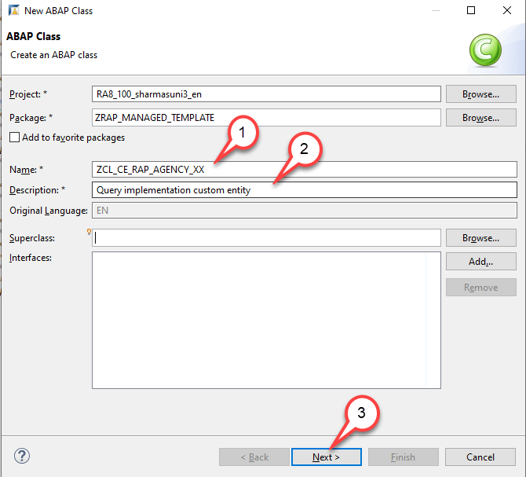
 
4.	Add interface IF_RAP_QUERY_PROVIDER to the query implementation class ZCL_CE_RAP_AGENCY_XX  
  Add the following statement in the public section  
  INTERFACES if_rap_query_provider.     
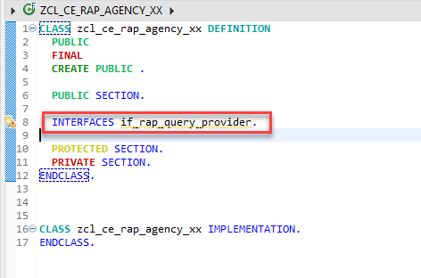 

5.	Add an implementation for the method if_rap_query_provider~select.  
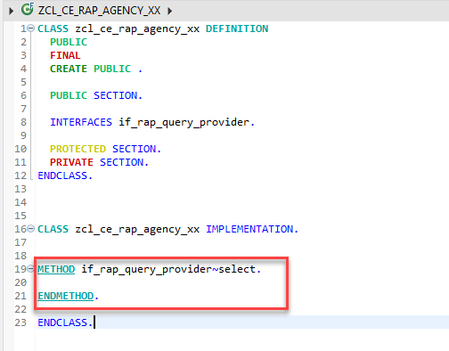

6.	Implement the method if_rap_query_provider~select. Within the select() method, we can retrieve the details of the incoming OData call using the object io_request.
Using the method get_paging() we can find out whether client side paging was requested with the incoming OData call. Using the method get_filter() we can retrieve the filter that was used by the incoming OData request and by calling the method ->get_as_ranges( ) provided by the filter object we can retrieve the filter as ranges.
Using the methods is_data_requested( ) and is_total_numb_of_rec_requested( ) we are able to find out whether the incoming request requests that business data is returned and whether the request contains a $count.  

Please note:  
If business data is requested, It is mandatory to add the retrieved data via the method set_data() .  

If in addition, the number of all entries of an entity is requested, the number of entities being returned must be set via the method set_total_number_of_records(). 
Copy and paste the coding below into the implementation of the method if_rap_query_provider~select.  

```
METHOD if_rap_query_provider~select.

   DATA: filter_factory   TYPE REF TO /iwbep/if_cp_filter_factory,
          filter_node      TYPE REF TO /iwbep/if_cp_filter_node,
          root_filter_node TYPE REF TO /iwbep/if_cp_filter_node.

    DATA: lt_business_data TYPE TABLE OF zrap_xxz_travel_agency_es5.

    DATA(top)     = io_request->get_paging( )->get_page_size( ).
    DATA(skip)    = io_request->get_paging( )->get_offset( ).
    DATA(requested_fields)  = io_request->get_requested_elements( ).
    DATA(sort_order)    = io_request->get_sort_elements( ).

    TRY.
        DATA(lt_filter_condition) = io_request->get_filter( )->get_as_ranges( ).
      CATCH cx_rap_query_filter_no_range.
    ENDTRY.

    TRY.
        DATA(lv_http_destination) = cl_http_destination_provider=>create_by_url( i_url = 'https://sapes5.sapdevcenter.com/' ).
        DATA(lo_http_client) = cl_web_http_client_manager=>create_by_http_destination( i_destination = lv_http_destination ).

        TRY.
         DATA(lo_client_proxy) = cl_web_odata_client_factory=>create_v2_remote_proxy(
              EXPORTING
                iv_service_definition_name = 'ZSC_RAP_AGENCY_XX'
                io_http_client             = lo_http_client
                iv_relative_service_root   = '/sap/opu/odata/sap/ZAGENCYCDS_SRV').

        CATCH: /iwbep/cx_gateway, cx_web_http_client_error.
            " Error handling
       ENDTRY.

 " Navigate to the resource and create a request for the read operation
        DATA(lo_read_list_request) = lo_client_proxy->create_resource_for_entity_set( 'Z_TRAVEL_AGENCY_ES5' )->create_request_for_read( ).

 " Create the filter tree
         filter_factory = lo_read_list_request->create_filter_factory( ).

         LOOP AT lt_filter_condition INTO DATA(filter_condition).
          filter_node = filter_factory->create_by_range(  iv_property_path = filter_condition-name
                                                          it_range         = filter_condition-range ).

          IF root_filter_node IS INITIAL.
            root_filter_node = filter_node.
          ELSE.
            root_filter_node = root_filter_node->and( filter_node ).
          ENDIF.
         ENDLOOP.

          IF root_filter_node IS NOT INITIAL.
            lo_read_list_request->set_filter( root_filter_node ).
          ENDIF.

          IF io_request->is_data_requested( ) = abap_true.
            lo_read_list_request->set_skip( CONV i( skip ) ).
            IF top > 0 .
              lo_read_list_request->set_top( CONV i( top ) ).
            ENDIF.
          ENDIF.

          IF io_request->is_total_numb_of_rec_requested(  ) = abap_true.
            lo_read_list_request->request_count(  ).
          ENDIF.

  " Execute the request and retrieve the business data
        DATA(lo_read_list_response) = lo_read_list_request->execute( ).

        lo_read_list_response->get_business_data( IMPORTING et_business_data = lt_business_data ).

        IF io_request->is_total_numb_of_rec_requested(  ).
          io_response->set_total_number_of_records(  lo_read_list_response->get_count(  ) ).
        ENDIF.

        IF io_request->is_data_requested(  ).
          io_response->set_data( lt_business_data ).
        ENDIF.

      CATCH /iwbep/cx_cp_remote INTO DATA(lx_remote).
  " Handle remote Exception

      CATCH /iwbep/cx_gateway INTO DATA(lx_gateway).
  " Handle Exception
    ENDTRY.

ENDMETHOD.
```

7.	Save and activate your changes.  

Summary  
You have implemented the query implementation class of the custom entity. As a result we can now enhance the implementation of our managed business object that we have created to use the custom entity as a value help  
Enhance the manage BO entity  
1.	Open projection view of root BO.  
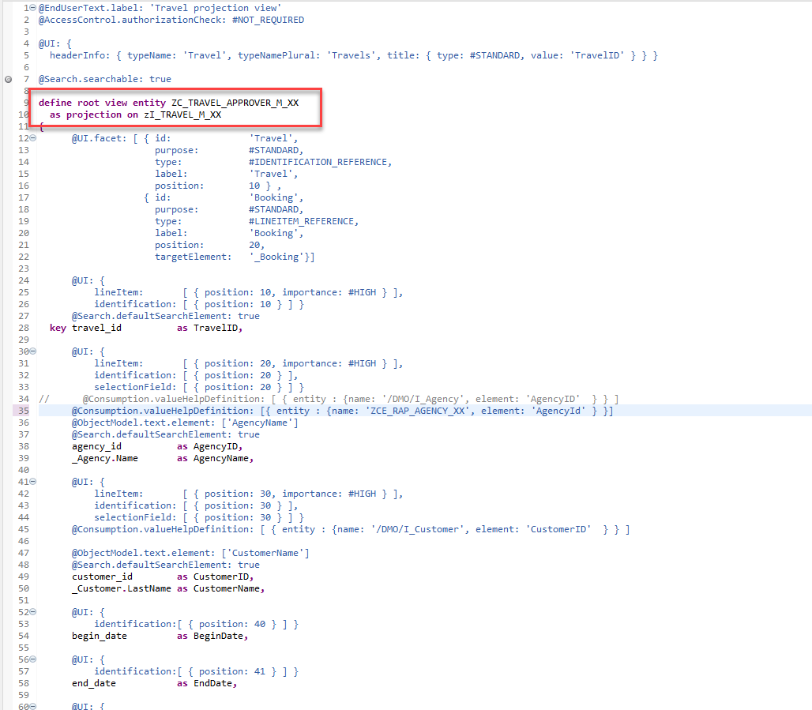 

2.	Add annotation for agency field for using custom entity as value help and activate.  
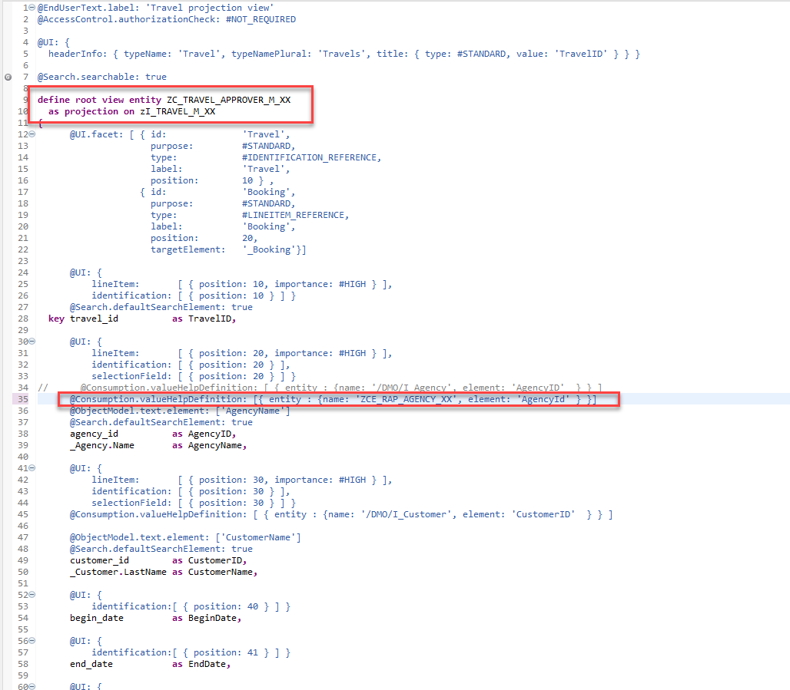


